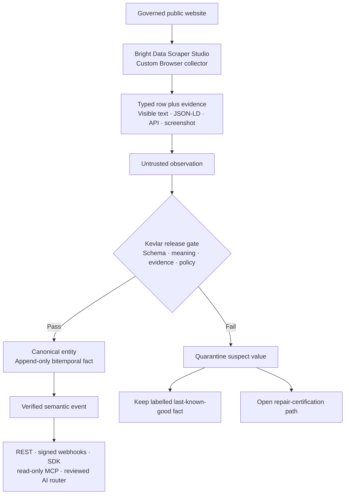
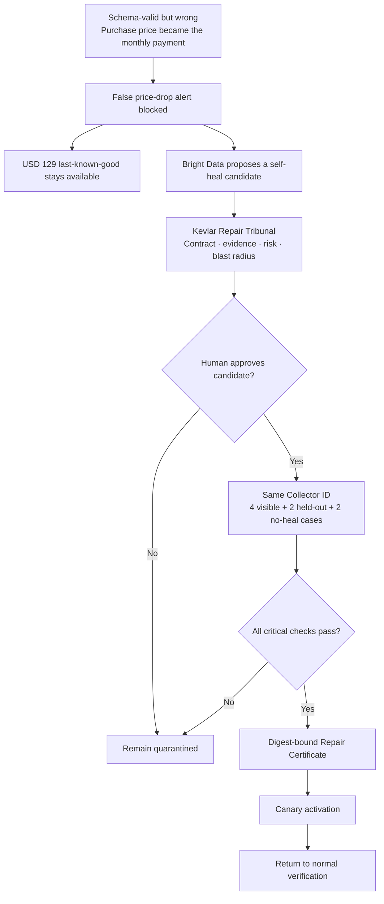

# Kevlar — one-minute project explainer

> **Kevlar is a verification firewall for live-web intelligence: Bright Data collects and self-heals, while Kevlar decides what is safe to release.**

Use this page as the visual for the first minute of the hackathon video. Show the main flow first, then the repair flow.

## 1. Core system flow



The invariant behind the diagram is:

```text
collector row != verified observation != released fact
```

## 2. Repair-certification flow



## Use these diagrams in the voiceover video

- Record the **Core system flow** as Clip 2 for 21 seconds.
- Record the **Repair-certification flow** as Clip 3 for 30 seconds.
- Follow the exact cursor paths and voiceover in [`video.md`](video.md).

The narration is centralized in `video.md` so there is only one script to rehearse and edit.

## Three ideas the judge should remember

1. **A successful scrape is not automatically true.** Kevlar verifies semantic meaning before release.
2. **Bright Data is central.** Its custom Scraper Studio collector performs acquisition, structured extraction, evidence capture, and the repair workflow.
3. **A self-heal is still untrusted.** It must pass human review, held-out tests, negative controls, and certification before canary activation.

## Closing line

> **Bright Data keeps collectors alive. Kevlar keeps the facts honest.**
