# Kevlar

> **The changing web, verified before it reaches your systems.**

[](https://kevlar-web.vercel.app)
[](https://github.com/Avinash1286/kevlar/releases/tag/v1.0.1)
[](docs/RELEASE_NOTES.md)
[](docs/BENCHMARK.md)
[](LICENSE)

Kevlar is a **verification firewall for live-web intelligence**. Custom Bright Data Scraper Studio collectors acquire public pricing, catalog, and changelog data, but a successful scrape is never treated as truth automatically. Kevlar validates meaning, preserves evidence and history, quarantines unsafe output, certifies repairs, and releases only policy-approved facts and semantic events to applications and AI consumers.

**Bright Data runs custom collectors and proposes repairs. Kevlar decides what may be released.**

Built for **Into the Scrape-Verse — WeMakeDevs × Bright Data**.

## Judge fast path

| Review target                       | Link                                                                                                                                                                                       |
| ----------------------------------- | ------------------------------------------------------------------------------------------------------------------------------------------------------------------------------------------ |
| Live operator and developer console | [kevlar-web.vercel.app](https://kevlar-web.vercel.app)                                                                                                                                     |
| Immutable public release            | [v1.0.1](https://github.com/Avinash1286/kevlar/releases/tag/v1.0.1)                                                                                                                        |
| Measured results                    | [benchmark report](docs/BENCHMARK.md) · [raw benchmark](benchmarks/results/v1.0.1.json) · [live E2E](benchmarks/results/v1.0.1-e2e.json) · [load run](benchmarks/results/v1.0.1-load.json) |

## Table of contents

- [Why Kevlar exists](#why-kevlar-exists)
- [What makes it different](#what-makes-it-different)
- [Hackathon highlights](#hackathon-highlights)
- [System architecture](#system-architecture)
- [Features](#features)
- [Why Bright Data Scraper Studio is central](#why-bright-data-scraper-studio-is-central)
- [Repair certification](#repair-certification)
- [Canonical intelligence and bitemporal history](#canonical-intelligence-and-bitemporal-history)
- [Evidence and delivery](#evidence-and-delivery)
- [Security, tenancy, and deployment](#security-tenancy-and-deployment)
- [Measured v1.0.1 evidence](#measured-v101-evidence)
- [Run it locally](#run-it-locally)
- [Verify the release](#verify-the-release)
- [Repository map](#repository-map)
- [Known boundaries](#known-boundaries)

## Why Kevlar exists

Web extraction can fail without throwing an error. A page redesign may leave a scraper returning valid JSON with the **wrong meaning**. Schema validation sees the expected number and currency fields and passes the row, while a downstream pricing engine, alert, or AI agent receives silent corruption.

The controlled Nova example makes that failure concrete:

1. The page shows a one-time purchase price of **$129** and financing of **$10.75/month**.
2. A structurally valid broken collector mistakes the financing amount for the purchase price, leaving both fields at `$10.75`.
3. Schema-only validation still accepts the output.
4. Kevlar's semantic contract catches the mismatch, quarantines the observation, and continues serving the explicitly labelled **$129 last-known-good** fact.
5. Bright Data can propose a repair, but the repair cannot affect released data until Kevlar's Tribunal, Gauntlet, and certificate gates pass.

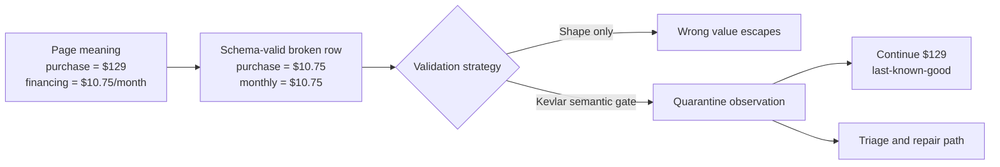

The foundational invariant is:

```text
collector row != verified observation != released fact
```

No UI, API, webhook, SDK, MCP tool, or AI consumer is allowed to read around that release boundary.

## What makes it different

Most scraping systems answer: **“Did extraction run?”** Kevlar also asks:

- Does the extracted value still mean what the field claims it means?
- Is the source authorized for this exact predicate?
- Do the available corroborating extraction channels agree?
- Did a page redesign occur, or did the real-world fact change?
- Is a repair general, or did it overfit the one page that triggered it?
- What value should remain available while the new observation is unsafe?
- Can every released fact be traced back through mapping, identity, policy, evidence, and certificate?

Kevlar turns those questions into deterministic, testable release gates rather than post-incident investigation.

## Hackathon highlights

| Highlight                                   | Why it matters                                                                                                                                                                                                                                |
| ------------------------------------------- | --------------------------------------------------------------------------------------------------------------------------------------------------------------------------------------------------------------------------------------------- |
| **Bright Data is the core runtime**         | Custom Scraper Studio Browser workers perform navigation, interaction, extraction, structured output, evidence tagging, and the provider repair workflow. Removing Scraper Studio removes acquisition and repair, not an optional enrichment. |
| **Semantic correctness beyond JSON Schema** | Kevlar catches a schema-valid financing-as-purchase-price misbinding that ordinary structural validation accepts.                                                                                                                             |
| **Repairs must generalize**                 | In the controlled Nova certification path, the repaired collector faces four visible mutations, two held-out mutations, and two no-heal negative controls before certification.                                                               |
| **Fail closed without going dark**          | Unsafe output is quarantined while an explicitly stale-aware last-known-good fact remains available.                                                                                                                                          |
| **Facts, not snapshots**                    | Deterministic mappings, canonical identity, predicate authority, bitemporal history, and semantic CDC convert source observations into auditable intelligence.                                                                                |
| **Evidence travels with the result**        | Source contexts, hashes, mappings, decisions, fact versions, events, and repair certificates remain connected.                                                                                                                                |
| **Production-shaped delivery**              | Released intelligence is available through REST, HMAC-signed webhooks, an in-repository TypeScript SDK, read-only MCP, and a reviewed AI-router consumer.                                                                                     |
| **Measured and honestly scoped**            | v1.0.1 records 24/24 controlled checks, zero false releases in labelled certification cases, 18/18 healthy deployed pages, and 80/80 load requests without presenting fixture results as population accuracy.                                 |

## System architecture

Kevlar is organized into four cooperating planes:

- **Data plane:** acquisition, observations, canonical entities, facts, events, and delivery.
- **Control plane:** projects, governed sources, schedules, approvals, and predicate-specific release policy.
- **Trust plane:** contracts, triage, quarantine, Tribunal, Gauntlet, evidence, and certificates.
- **Developer plane:** REST, webhooks, SDK, MCP, documentation, and usage metering.

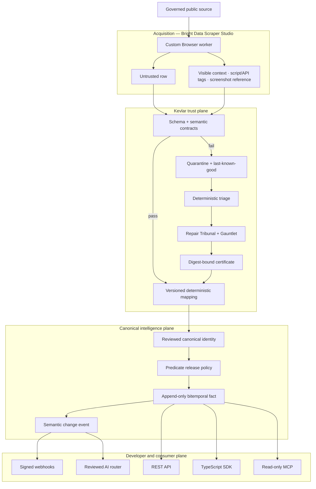

The normal path and the failure path are equally important: a successful collector run still enters as untrusted input, while a failed trust gate creates an explicit state transition instead of a missing or silently overwritten record.

## Features

### Acquisition and source governance

- Custom Bright Data Scraper Studio collectors for product pricing, AI pricing, model catalogs, and release notes.
- Exact HTTPS host/path allowlists, public-data declarations, cadence, concurrency, daily quota, and owner/review requirements.
- Input and output JSON Schemas stored beside every collector.
- Stable `c_*` Collector IDs for every registered collector, with sanitized creation/run evidence where available.
- Visible contexts, content digests, script tags, network-response tags, and screenshot references where the contract permits them.
- Bounded trigger/poll workflows with persisted provider job and snapshot references.
- Predicate-level source authority: a pricing page cannot silently become lifecycle authority, and a catalog page cannot establish unrelated billing facts.

### Trust and repair kernel

- Versioned structural and semantic contracts.
- Deterministic failure triage across schema, semantics, absence, blocking, timeout, and evidence failures.
- Append-only decision and provenance lineage, with raw evidence subject to retention and deletion policy.
- Explicit states for verified, quarantined, last-known-good, stale, and needs-review data.
- Quarantine that prevents unsafe replacements from reaching downstream systems.
- Repair Tribunal checks covering evidence, contract fit, selector risk, mapping, identity, source policy, and blast radius.
- Canary execution plus visible, held-out, and negative-control Gauntlet cases.
- Digest-bound Repair Certificates tied to the exact candidate and test result.
- Idempotent multi-step workflows and stable operation keys.
- AI remains advisory: it cannot approve a repair, merge an identity, release a fact, or activate a production route.

### Canonical intelligence

- Versioned deterministic mappings with field-level provenance.
- Canonical entity resolution from exact identifiers and reviewed aliases.
- Ambiguity queues for high-risk matches instead of forced merges.
- Audited, reversible entity merge and split lineage.
- Append-only bitemporal fact versions with derived current projections.
- Predicate-specific reconciliation across sources.
- Explicit release, withhold, conflict, continue-last-known-good, no-change, quarantine, absence, and human-review decisions.
- Semantic change-data capture that suppresses presentation-only drift while emitting meaningful changes, corrections, conflicts, retractions, deprecations, and supersessions.
- Stable event IDs so retries do not create duplicate business events.

### Evidence and developer delivery

- Evidence bundles connecting source capture, raw context, observation, mapping, identity, release decision, fact, event, and certificate.
- Integrity digests for mismatch detection.
- Scoped REST API with hashed API-key storage, request IDs, pagination, standard errors, and rate-limit metadata.
- HMAC-signed webhooks with retries, dead-letter handling, and labelled replay.
- TypeScript SDK backed by the same Zod contracts as the API.
- Read-only MCP tools for released current facts and fact history.
- Verified-event-only AI router with signature verification, deduplication, prompt-injection isolation, review, and canary gates.

### Security, operations, and recovery

- Password authentication, organization membership, RBAC, project ownership, and tenant isolation.
- Public-demo publication boundary separated from private tenant records.
- HTTPS-only outbound URL guard with credential rejection, redirect revalidation, and private/loopback/link-local protection.
- Server-side provider credentials; stored API keys and webhook secrets are represented by hashes, visible prefixes, or external secret references rather than plaintext.
- Recursive redaction for logs, dashboards, and alerts.
- Freshness, source health, delivery health, provider circuits, cost units, backup status, and active-alert dashboards.
- Deduplicated alerts linked to runbooks for provider failure, Bright Data pending jobs, duplicate events, source outages, webhook failures, and freshness breaches.
- Snapshot/export manifests with counts and digests.
- Bounded, idempotent project deletion that redacts raw payloads while retaining an audit tombstone.
- Documented Vercel and Convex-safe rollback procedures.

## Why Bright Data Scraper Studio is central

Kevlar's core path does **not** use a prebuilt Scrapers Library collector, and Bright Data is not reduced to an HTML downloader. Meaningful extraction happens inside custom Scraper Studio Browser workers.

### Division of responsibility

| Bright Data Scraper Studio          | Kevlar                                                   | Human boundary                                                       |
| ----------------------------------- | -------------------------------------------------------- | -------------------------------------------------------------------- |
| Navigate approved pages             | Validate input host/path policy                          | Review source usage and applicable terms                             |
| Interact with dynamic browser state | Treat every row as untrusted                             | Approve or reject high-impact repair decisions                       |
| Parse visible content               | Validate schema and semantic meaning                     | Review ambiguous entity merges                                       |
| Tag scripts and network responses   | Persist evidence and provenance                          | Promote provider-active collectors only after certification          |
| Capture screenshot references       | Map, identify, reconcile, and release facts              | Decide whether to promote Convex to a separate production deployment |
| Produce typed structured output     | Quarantine unsafe observations and serve last-known-good | Supply account-scoped provider authorization                         |
| Propose/apply AI Flow repairs       | Run Tribunal, Gauntlet, and certificate gates            | Submit final hackathon identity/eligibility attestations             |

### Acquisition flow

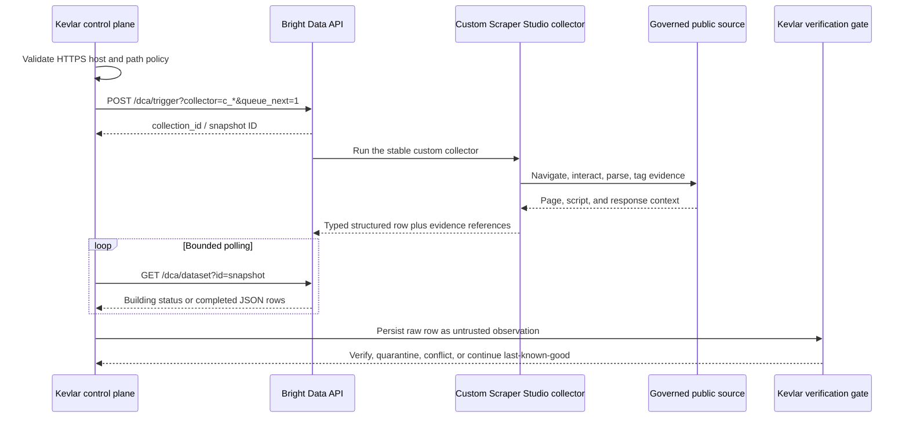

The runtime adapter uses Bright Data's asynchronous collection contract:

1. Kevlar validates the requested URL against the source's exact governed boundary.
2. `POST /dca/trigger?collector=<c_*>&queue_next=1` starts the custom collector and returns `collection_id`.
3. Kevlar retains that value as the snapshot reference.
4. `GET /dca/dataset?id=<snapshot>` uses bounded polling until it returns rows or a terminal failure.
5. The raw row and evidence references are persisted without granting them verified status.
6. Contracts, mapping, identity, authority, reconciliation, and release policy decide whether a field can become a released fact.

Webhook receipt is notification-only and cannot bypass snapshot polling or verification.

Repository proof: [Bright Data adapter](packages/brightdata-runtime/src/index.ts), [integration documentation](docs/BRIGHT_DATA.md), [Nova interaction code](collectors/product-pricing/nova/interaction.js), [Nova parser](collectors/product-pricing/nova/parser.js), [input schema](collectors/product-pricing/nova/input-schema.json), and [output schema](collectors/product-pricing/nova/output-schema.json).

### Nova: the fully rehearsed collector

The central release proof uses the custom Nova product-pricing collector, **`c_mt3utzwt29hbznvax9`**. Its required input is a governed `url` string. Inside Scraper Studio it:

1. tags the page's product JSON-LD;
2. tags the controlled public product API response;
3. navigates the browser to the approved Nova page;
4. waits for explicit success, not-found, or blocked states;
5. captures a screenshot reference;
6. parses product identity, one-time price, monthly payment, availability, visible purchase context, and evidence;
7. emits one typed record matching the committed output schema.

The JSON-LD, public API response, visible text, and screenshot are multiple extraction channels from the same controlled source environment. They strengthen provenance, but they are not represented as independent market authorities.

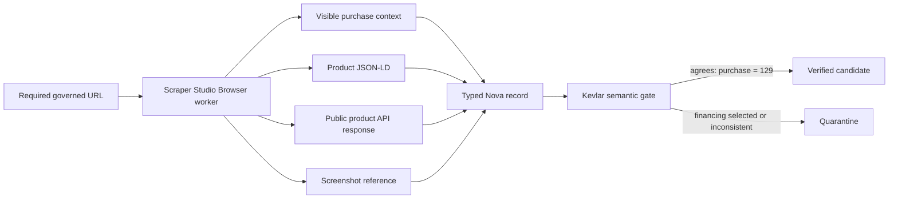

### Collector mesh and evidence-qualified status

A recorded Collector ID proves that a custom collector exists. It does **not** by itself prove that its current output satisfies Kevlar's contract or is safe for release.

| Governed source         | Collector ID           | Evidence-qualified state                                                                                         |
| ----------------------- | ---------------------- | ---------------------------------------------------------------------------------------------------------------- |
| Nova product pricing    | `c_mt3utzwt29hbznvax9` | Fully rehearsed controlled acquisition, semantic-regression, same-ID repair, and certification path              |
| OpenAI API pricing      | `c_mt460ht33qmbg7m8k`  | Governed custom ID and schema recorded                                                                           |
| OpenAI model catalog    | `c_mt44w77a1irbn8ooh`  | Governed custom ID and schema recorded                                                                           |
| Anthropic release notes | `c_mt43rdlsyxpwuqofn`  | Governed custom ID and schema recorded                                                                           |
| Anthropic API pricing   | `c_mt4e7tgw1i46wxboqa` | Bright Data active with a completed run; Kevlar rejected the snapshot as `schema_invalid`; certification pending |
| Anthropic model catalog | `c_mt4e811ufis8kdvlt`  | Bright Data active with a completed run; Kevlar rejected the snapshot as `schema_invalid`; certification pending |

Only Nova is labelled fully rehearsed. The next three collectors have governed IDs and schemas only; the final two additionally have provider-active but rejected runs. None of those five rows is implied to be Kevlar-certified or production-ready. The exact maturity chain is:

```text
ID recorded != Bright Data active != run completed != schema-valid != Kevlar-certified != released
```

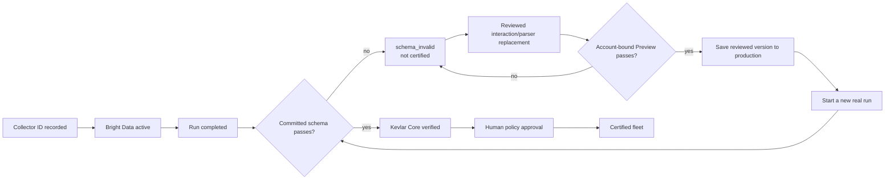

## Repair certification

A Bright Data self-heal preview is a **candidate**, not a certificate. Kevlar keeps serving last-known-good data while the repair is evaluated.

### Provider and Kevlar repair flow

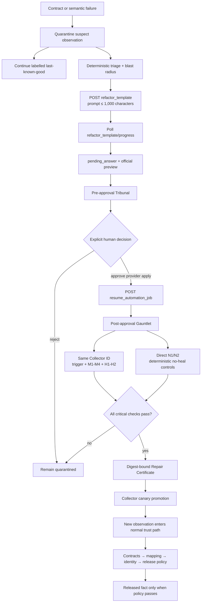

The documented Bright Data AI Flow is:

1. `POST /dca/collectors/{collector_id}/refactor_template` starts a bounded repair request with controlled inputs and a prompt of at most 1,000 characters.
2. `GET /dca/collectors/{collector_id}/refactor_template/progress` uses bounded polling.
3. `pending_answer` marks the human-review boundary. Kevlar persists the official preview and runs its pre-approval Tribunal.
4. `POST /dca/collectors/{collector_id}/resume_automation_job` sends an explicit Boolean approval or rejection. `auto_save` is allowed only after the audited decision.
5. The same Collector ID is triggered again for the failing case, four visible mutations, and two held-out mutations. N1 and N2 are fetched and evaluated separately as deterministic no-heal controls.
6. Every critical check must pass before Kevlar creates a certificate or promotes the repair.

### Gauntlet composition

| Suite              | Count | Purpose                                                                                                |
| ------------------ | ----: | ------------------------------------------------------------------------------------------------------ |
| Triggering case    |     1 | Prove the original semantic failure is fixed                                                           |
| Visible mutations  |     4 | Exercise known DOM and presentation variations                                                         |
| Held-out mutations |     2 | Test generalization against relations hidden from the repair prompt                                    |
| Negative controls  |     2 | Ensure the system does not “heal” a blocked page or a genuinely unavailable product into invented data |

Every certificate is bound to the candidate digest, collector identity, test inventory, observed outcomes, and release decision. A failed candidate cannot create a release certificate.

## Canonical intelligence and bitemporal history

A verified row is still only an observation. Kevlar converts observations from multiple governed sources into canonical, time-aware facts through a separate intelligence pipeline.

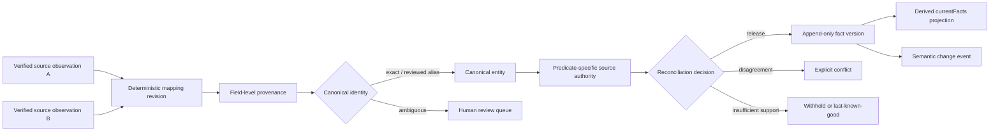

### Why bitemporal storage matters

Kevlar keeps two timelines:

- **Valid time:** when the claim applies in the outside world, if the source states it.
- **Transaction time:** when Kevlar learned, released, corrected, or superseded that belief.

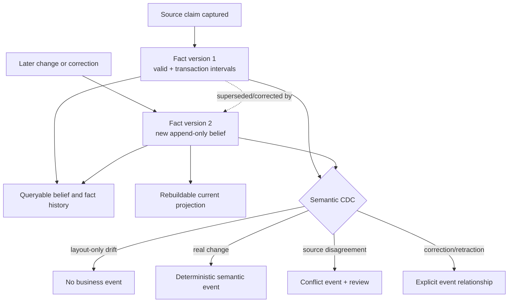

Missing source data is not interpreted as deletion. A correction appends a new belief and relation; it does not rewrite the prior observation or fact version.

## Evidence and delivery

### Evidence lineage

Evidence is referenced, hashed, and propagated through the release path instead of being flattened into an untraceable summary.

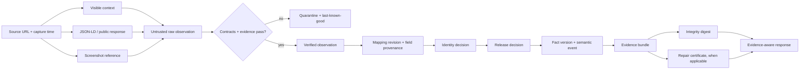

An integrity digest detects content mismatch; it is not a digital signature or proof of source authorship. Bulky evidence is retention-bound and may be redacted while historical decisions and digests remain auditable.

### Downstream delivery

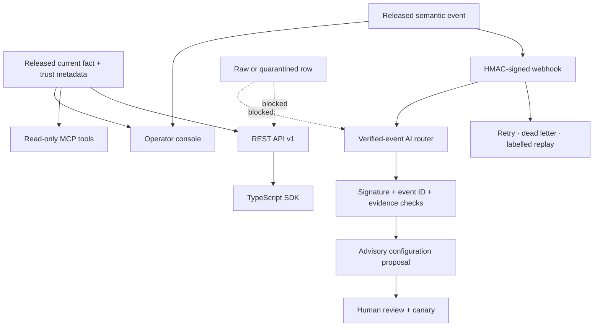

Delivery consumers receive released data with trust state, freshness, sources, evidence references, and certificate references. The AI router can propose a downstream change, but it cannot autonomously approve or activate it.

## Security, tenancy, and deployment

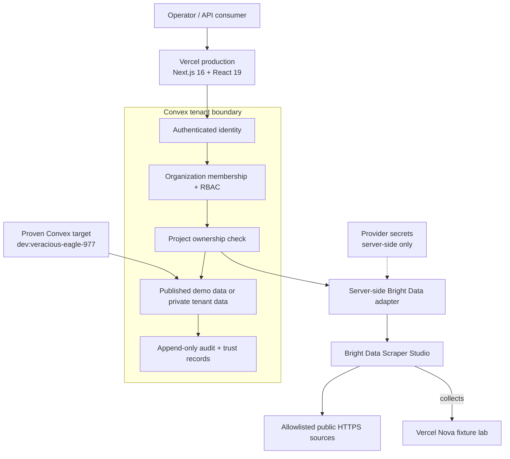

### Deployed topology

| Surface                                                                                     | Role                                                                             | v1.0.1 evidence state                                                                          |
| ------------------------------------------------------------------------------------------- | -------------------------------------------------------------------------------- | ---------------------------------------------------------------------------------------------- |
| [kevlar-web.vercel.app](https://kevlar-web.vercel.app)                                      | Public operator/developer console and REST surface                               | Production Vercel deployment `dpl_8vNdRudfWrnmNDf8eau5GGSpZCYc`                                |
| [kevlar-fixture-lab.vercel.app](https://kevlar-fixture-lab.vercel.app/product-pricing/nova) | Controlled Nova semantic-regression fixture                                      | Public controlled fixture used by the rehearsed collector                                      |
| Convex `veracious-eagle-977`                                                                | Reactive data, workflows, authorization, evidence, facts, events, and operations | Intentionally proven against a **development** deployment; stable public project `kevlar-core` |
| Bright Data Scraper Studio                                                                  | Custom collector mesh and provider repair workflow                               | Account-scoped custom collectors; states are listed individually above                         |

Vercel project links are intentionally ignored and the Vercel CLI is not pinned in this repository. A clean clone should import or link `apps/web` and `apps/fixture-lab` as two separate Vercel projects, configure the web project's `NEXT_PUBLIC_CONVEX_URL`, and verify the resulting aliases before promotion.

Provider credentials never enter public Next.js variables. Authenticated identity, not a client-supplied actor ID, determines membership and access. Cross-project requests are denied without exposing whether another tenant's resource exists.

### Live console map

| Area                   | Verified static routes                                       | What judges can inspect                                                                    |
| ---------------------- | ------------------------------------------------------------ | ------------------------------------------------------------------------------------------ |
| Overview               | `/`                                                          | Product thesis, controlled proof, and release summary                                      |
| Trust kernel           | `/gauntlet`, `/fleet/repairs`, `/evidence`, `/feed`          | Repair cases, certification gates, evidence, and released facts                            |
| Intelligence           | `/sources`, `/entities`, `/history`, `/events`, `/conflicts` | Source governance, canonical identity, bitemporal history, semantic CDC, and conflicts     |
| Delivery and AI        | `/developers`, `/subscriptions`, `/router`                   | REST, webhook, SDK, MCP, subscriptions, and reviewed verified-event routing                |
| Operations and release | `/operations`, `/security`, `/release`                       | Freshness, provider/delivery health, cost, alerts, tenancy, recovery, and release evidence |
| Access                 | `/sign-in`                                                   | Password authentication boundary                                                           |

Incident, certificate, collector, mapping, and project detail pages are parameterized and should be opened through console links carrying a concrete record ID, not as bare static paths.

## Measured v1.0.1 evidence

The release measurements are committed artifacts, not placeholders.

| Metric                         |                      Measured result | Scope                                                                                    |
| ------------------------------ | -----------------------------------: | ---------------------------------------------------------------------------------------- |
| Automated tests                |          **133/133** across 24 files | Unit, integration, security, authz, trust, intelligence, delivery, and operations suites |
| Controlled labelled checks     |                            **24/24** | Fixture-backed release benchmark                                                         |
| Silent-corruption catch        |                              **1/1** | One labelled financing-as-purchase-price misbinding                                      |
| Correct triage                 |                              **9/9** | Nine deterministic failure classes                                                       |
| False-heal rate                |                              **0/2** | Two negative no-heal controls                                                            |
| Held-out repair pass           |                              **2/2** | Two undisclosed DOM relations                                                            |
| Critical false releases        |                                **0** | Eight controlled repair-certification cases                                              |
| False quarantine               |                              **0/6** | Six valid visible or held-out mutation cases                                             |
| Semantic-event precision       |                              **3/3** | Three emitted semantic events; layout-only drift suppressed                              |
| Semantic-event recall          |                              **3/3** | Three labelled changes, corrections, or conflicts                                        |
| Last-known-good availability   |                              **1/1** | Controlled semantic-misbinding continuity case                                           |
| Entity-resolution accuracy     |                              **3/3** | Exact, ambiguous, and AI-suggestion labels                                               |
| Delivery success               |                              **2/2** | First-attempt and dead-letter replay paths                                               |
| Live full-flow assertions      |                              **7/7** | Across **18/18** healthy deployed pages                                                  |
| Production request success     |                            **80/80** | Ten concurrent requests across eight pages                                               |
| Production HTTP latency        | **302.80 ms median; 1193.86 ms p95** | Fresh 80-request batch against the final Vercel alias                                    |
| Controlled proof workload cost |                            **$0.01** | Phase 11 proof estimate, not a cost forecast                                             |

Five layered baselines show what each verification layer adds: schema-only extraction; semantic contracts; contracts plus executed mapping and provenance; full Kevlar without held-out repairs; and the full platform with held-out repair, triage, identity, semantic CDC, delivery, tenant security, operations, and reviewed AI routing.

> These numbers are controlled, fixture-backed regression measurements. They are not statistically representative claims about all websites, sources, or future layouts. “Zero false releases” refers only to the labelled controlled certification cases.

See [BENCHMARK.md](docs/BENCHMARK.md) for definitions and limitations and [v1.0.1.json](benchmarks/results/v1.0.1.json) for raw cases, hashes, timings, and outputs.

## Run it locally

### Requirements

- Node.js **22 or newer**
- pnpm **10.33.0** through Corepack
- Git
- A Convex account only when connecting a fresh clone to a hosted backend
- Bright Data credentials only for live custom-collector and repair workflows

### Install and run deterministic checks

These checks do not require provider credentials:

```bash
git clone https://github.com/Avinash1286/kevlar.git
cd kevlar
corepack enable
pnpm install --frozen-lockfile
pnpm lint
pnpm typecheck
pnpm test
pnpm build
```

### Configure the local applications

The public pages can render their safe fixture/proof state without provider secrets. To connect dynamic backend data or run scripts that require `--env-file=.env.local`, copy the ignored template:

```bash
cp .env.example .env.local
```

PowerShell equivalent:

```powershell
Copy-Item .env.example .env.local
```

The root `.env.local` is for repository scripts. Next.js runs from each app directory and does not reliably load that root file. For dynamic local web data, create `apps/web/.env.local` containing only the public deployment URL:

```dotenv
NEXT_PUBLIC_CONVEX_URL=https://your-deployment.convex.cloud
```

Create the equivalent `apps/fixture-lab/.env.local` only if the fixture should use Convex state. Do **not** copy the server-secret-filled root file into either application directory.

For a fresh Convex project, authenticate and start its long-running development process in its own terminal. It may be stopped after the initial deployment if live function syncing is no longer needed:

```bash
pnpm convex:dev
```

Start the applications in separate terminals. The explicit fixture port avoids the two Next.js packages competing for port 3000:

```bash
# Terminal 1 — operator application
pnpm dev:web

# Terminal 2 — controlled fixture
pnpm --filter @kevlar/fixture-lab exec next dev --port 3001
```

- Console: `http://localhost:3000`
- Nova fixture: `http://localhost:3001/product-pricing/nova`

### Runtime environment groups

Not every placeholder in [`.env.example`](.env.example) is required. Configure only the capabilities you run:

| Capability                                         | Variables                                                                                                                                               |
| -------------------------------------------------- | ------------------------------------------------------------------------------------------------------------------------------------------------------- |
| Dynamic web/backend and sign-in                    | `NEXT_PUBLIC_CONVEX_URL`                                                                                                                                |
| Release backend preparation                        | `CONVEX_URL` or `NEXT_PUBLIC_CONVEX_URL`, plus `KEVLAR_BASELINE_INGEST_KEY`                                                                             |
| Release E2E                                        | `CONVEX_URL` or `NEXT_PUBLIC_CONVEX_URL`; optional `KEVLAR_PUBLIC_URL` override                                                                         |
| Fixture reset                                      | `CONVEX_URL` and `KEVLAR_BASELINE_INGEST_KEY`                                                                                                           |
| Nova baseline, semantic misbinding, and Core proof | `CONVEX_URL`, `KEVLAR_BASELINE_INGEST_KEY`, `BRIGHT_DATA_API_KEY`, `BRIGHT_DATA_COLLECTOR_ID`, and `FIXTURE_BASE_URL`                                   |
| Bright Data fleet inspection/verification          | `BRIGHT_DATA_API_KEY`; `phase5:verify` takes the Collector ID as an argument, while `phase5:collector -- snapshot` also uses `BRIGHT_DATA_COLLECTOR_ID` |
| Bright Data fleet run/certification                | `BRIGHT_DATA_API_KEY`, `CONVEX_URL`, and `KEVLAR_BASELINE_INGEST_KEY`                                                                                   |
| Convex CLI deployment                              | `CONVEX_DEPLOY_KEY` when required by the selected environment                                                                                           |
| Public load/demo override                          | Optional `KEVLAR_PUBLIC_URL`; defaults to `https://kevlar-web.vercel.app`                                                                               |

`CONVEX_URL` and `KEVLAR_PUBLIC_URL` are accepted by release scripts even though the current template does not list them. The other provider, delivery, and integrity placeholders in the template are reserved or capability-specific and should not be described as globally required.

Never commit `.env.local`, paste credentials into collector code, or expose server secrets through `NEXT_PUBLIC_*` variables.

## Verify the release

### Repository gates

```bash
pnpm lint
pnpm typecheck
pnpm test
pnpm build
pnpm format:check
```

### Evidence workflows

`release:benchmark` is deterministic, but `.env.local` must exist because the script is launched with `--env-file`. The E2E, load, and demo workflows use a configured backend, public traffic, or browser capture:

```bash
pnpm release:benchmark
pnpm release:e2e
pnpm release:load
pnpm exec playwright install chromium
pnpm release:demo
```

- `release:benchmark` writes the controlled benchmark artifact.
- `release:e2e` checks the public route set and proof-populated Convex records.
- `release:load` sends the bounded 80-request public batch.
- `release:demo` records the public walkthroughs after Chromium is installed.

`pnpm release:prepare-backend` publishes `kevlar-core` and seeds the source catalog in the selected Convex deployment. It is **not** a blank-backend bootstrap: `release:e2e` also expects the Phase 4, 7, 8, 10, and 11 proof records. Target the committed proof-populated deployment unless every phase proof has been seeded separately. The preparation command mutates its target and should not be treated as a casual local verification command.

Reruns overwrite local files under [`benchmarks/results/`](benchmarks/results/) or [`artifacts/demo/`](artifacts/demo/); they are new measurements and do not change the immutable `v1.0.1` tag automatically.

Useful targeted flows:

```bash
pnpm baseline:run
pnpm semantic-swap:run
pnpm phase4:run prepare
pnpm phase4:run approve <incident-id>
pnpm demo:reset

pnpm phase5:collector -- inspect <source-key> <collector-id>
pnpm phase5:verify -- <source-key> <collector-id>
pnpm phase5:run -- <source-key>
```

A policy-pending Anthropic source can use the restricted `--activate-policy <verified-snapshot-id>` path only after a real snapshot passes verification. The existing Anthropic rows remain `schema_invalid`.

`demo:reset` resets the controlled fixture. A fresh provider self-heal, approval, and same-ID certification replay still depends on the authenticated Bright Data account and is not implied by the reset command alone.

## Repository map

| Path                                                         | Purpose                                                                                          |
| ------------------------------------------------------------ | ------------------------------------------------------------------------------------------------ |
| [`apps/web`](apps/web)                                       | Next.js operator console, public release pages, and REST surface                                 |
| [`apps/fixture-lab`](apps/fixture-lab)                       | Controlled Nova product-pricing source and mutation fixtures                                     |
| [`collectors`](collectors)                                   | Scraper Studio schemas, interaction/parser code, source policies, IDs, and evidence              |
| [`packages/brightdata-runtime`](packages/brightdata-runtime) | Bright Data trigger, polling, response validation, and self-heal adapter                         |
| [`packages/semantic-contracts`](packages/semantic-contracts) | Product-pricing semantic contracts and verification rules                                        |
| [`packages/certification`](packages/certification)           | Gauntlet evaluation and Repair Certificate logic                                                 |
| [`packages/api-contracts`](packages/api-contracts)           | Shared REST/SDK runtime contracts                                                                |
| [`packages/sdk`](packages/sdk)                               | In-repository TypeScript client                                                                  |
| [`packages/mcp-server`](packages/mcp-server)                 | Read-only MCP tools for released intelligence                                                    |
| [`packages/ai-router`](packages/ai-router)                   | Verified-event-only advisory router integration                                                  |
| [`domains/ai-infrastructure`](domains/ai-infrastructure)     | Canonical schema, mappings, identity, and domain policies                                        |
| [`convex`](convex)                                           | Backend schema, functions, workflows, authz, facts, events, evidence, and operations             |
| [`tests`](tests)                                             | Unit, integration, security, tenant, trust, intelligence, and delivery tests                     |
| [`scripts`](scripts)                                         | Phase proofs, release benchmarks, E2E/load runs, demo capture, and recovery helpers              |
| [`benchmarks/results`](benchmarks/results)                   | Committed raw release measurements                                                               |
| [`docs`](docs)                                               | Architecture, trust, Bright Data, API, operations, security, recovery, and release documentation |

## Known boundaries

Kevlar is designed to make uncertainty explicit. v1.0.1 therefore documents these boundaries rather than hiding them:

- The benchmark is deliberately small and fixture-backed; it proves regressions in the committed cases, not perfect truth or general web accuracy.
- The current fleet focuses on AI-infrastructure sources and the Nova product-pricing regression; it does not claim broad domain coverage.
- The two provider-active Anthropic collectors currently return schema-invalid rows and remain pending Kevlar certification.
- Source evidence and configured authority can still be incomplete, stale, or wrong. Evidence supports a reviewable decision; it does not guarantee truth.
- Last-known-good prevents an unverified replacement but can become stale, so freshness remains separate from correctness.
- Valid time is preserved when a source states it. Otherwise capture time proves when Kevlar observed a claim, not when it first became true externally.
- The TypeScript SDK is in this repository, MCP is intentionally read-only, and GraphQL is outside v1.0.1.
- Password authentication is used with the installed Convex Auth release; enterprise identity providers should be added before broad organizational use.
- The public Vercel surface is production, while the proven Convex backend target is explicitly the development deployment `veracious-eagle-977`.
- A fresh Convex snapshot export and same-project manifest/query verification succeeded. An import/query restore into a separate throwaway deployment remains open because no Preview Deploy Key is available and preview creation is billing-gated.
- Bright Data IDE preview, save, activation, and self-heal approval are account-scoped. Kevlar cannot bypass provider authorization.

Read the full [limitations](docs/LIMITATIONS.md), [release scope](docs/RELEASE_SCOPE.md), [source governance policy](docs/SOURCE_GOVERNANCE.md), and [recovery boundary](docs/RECOVERY.md) before presenting or extending the release.

## Documentation

- Core design: [architecture](docs/ARCHITECTURE.md), [trust model](docs/TRUST.md), [bitemporal model](docs/TEMPORAL.md), and [decision records](docs/DECISIONS.md)
- Bright Data and governance: [integration](docs/BRIGHT_DATA.md), [source governance](docs/SOURCE_GOVERNANCE.md), and [pending collector activation](collectors/ai-infrastructure/ACTIVATE_ANTHROPIC_COLLECTORS.md)
- Developer platform: [REST API](docs/API.md), [TypeScript SDK](docs/SDK.md), and [MCP](docs/MCP.md)
- Operations: [security](docs/SECURITY.md), [operations](docs/OPERATIONS.md), [recovery](docs/RECOVERY.md), and [runbooks](docs/runbooks/)
- Release proof: [benchmark](docs/BENCHMARK.md), [release notes](docs/RELEASE_NOTES.md), and [release scope](docs/RELEASE_SCOPE.md)
- Hackathon: [AI coding-tool disclosure](AI_DISCLOSURE.md) and [third-party dependencies/assets](THIRD_PARTY_NOTICES.md)

## Contributing and license

See [CONTRIBUTING.md](CONTRIBUTING.md) for repository checks and contribution expectations. Security reports should follow [SECURITY.md](SECURITY.md).

Kevlar is released under the [MIT License](LICENSE).
