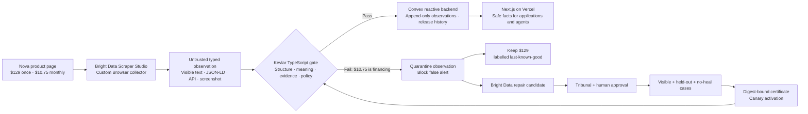

# Kevlar — 2:25 live hackathon demo

This is a **single continuous live presentation**, not a voiceover. Speak while moving through the real product. The whole explanation follows one practical story, so do not pause between sections or announce page names.

The final recording is **2 minutes 25 seconds**, leaving a five-second safety margin below 2:30.

It covers the form without breaking the story: the first 27 seconds introduce the project and architecture, the middle is the live demo, and the final screen gives the learning and measured result.

## The one practical scenario

Nova headphones cost **$129 once** or **$10.75 per month**. After a page redesign, a schema-valid scraper mistakes the monthly payment for the purchase price and could trigger a fake **nearly 92% price-drop alert**.

Kevlar prevents that value from reaching an application, keeps the labelled $129 last-known-good fact available, and allows a repaired Bright Data collector to return only after review, held-out testing, and certification.

## The architecture through that scenario

Use this diagram to understand the story before recording. You do not need to show it in the final video.



The architectural rule is simple:

```text
successful scrape != verified observation != released fact
```

## Prepare everything before recording

### Recording setup

1. Record at 1920×1080 or 1440×900.
2. Use one continuous screen-and-microphone recording. Do one silent navigation rehearsal before the real take.
3. Turn on Do Not Disturb. If the bookmarks bar is visible, hide it with `Ctrl+Shift+B`.
4. Open only the seven tabs below, in the exact order shown.
5. Load every page at least 30 seconds before recording. Do not refresh any page during the take.
6. Enter browser full screen with `F11`, then use `Ctrl+Tab` for every transition.
7. Keep the cursor in an empty margin until the script asks you to point at something.
8. Never display an API key, `.env` file, Convex deploy key, Bright Data credential, personal email, or browser profile menu.

### Open these seven tabs from left to right

| Tab | Page                                                                                           | Starting position                                                                   |
| --: | ---------------------------------------------------------------------------------------------- | ----------------------------------------------------------------------------------- |
|   1 | [Kevlar home](https://kevlar-web.vercel.app)                                                   | Top of the page with **Trust the fact. Question the repair.** visible.              |
|   2 | Bright Data collector Output                                                                   | Successful Output modal for `kevlar-nova-product-pricing`, positioned at `product`. |
|   3 | [Trust Feed](https://kevlar-web.vercel.app/feed)                                               | Comparison showing observed $10.75 and released $129.                               |
|   4 | [Held-Out Gauntlet](https://kevlar-web.vercel.app/gauntlet)                                    | Top of the page with 8/8, 100%, 0, and 0 visible.                                   |
|   5 | [Nova Repair Certificate](https://kevlar-web.vercel.app/certificates/nova-core-20260822075230) | Top of the certificate with the collector and case totals visible.                  |
|   6 | [Evidence Graph](https://kevlar-web.vercel.app/evidence)                                       | Top of the graph with its summary metrics visible.                                  |
|   7 | [Release Evidence](https://kevlar-web.vercel.app/release)                                      | Top of the page with `LABELED CHECKS 24/24` and `FALSE RELEASES 0`.                 |

### Prepare the Bright Data Output tab

Do all of this before recording:

1. Sign in to Bright Data, then click **Scrapers** in the left sidebar.
2. Open **kevlar-nova-product-pricing**.
3. Click **Code**, then **Interaction code**.
4. In the lower panel, click **Input** and enter this required `url`:

   ```text
   https://kevlar-fixture-lab.vercel.app/product-pricing/nova
   ```

5. Click the triangular Play button beside **Click play to test your code**.
6. Wait for a successful result. If the log says `navigate(undefined)` or `url is required`, return to **Input**, enter the URL again, and rerun it.
7. Click **Output**. If the large Output modal opens, stop clicking. Otherwise, click the single collected result once.
8. Confirm the output contains:
   - `page_state: ok`;
   - purchase price `129`;
   - monthly payment `10.75`;
   - JSON-LD price `129`;
   - public API price `129`;
   - a screenshot reference.
9. Set Bright Data browser zoom to 80% or 90% if needed so `129` and `10.75` both wrap into view.
10. Leave the modal open at the `product` row and switch back to Tab 1.

Crop the Bright Data capture so it does not show the credit balance, profile initial, Billing navigation, address-bar draft ID, Run log, peer IP, or account email. During the take, never click **Active scraper**, **Finish editing**, **Start**, a download button, or the three-dot menu.

## The continuous live script

The quoted passages form one story. Speak through every `Ctrl+Tab` transition; do not stop and restart your tone.

The complete script is about **302 written words**, averaging roughly **125 words per minute**. Spoken number phrases bring the natural delivery slightly higher while still leaving room to point, scroll, and breathe.

### 0:00–0:27 — Introduce the problem and architecture

**Screen:** Tab 1, Kevlar home.

**What to do:**

- From 0:00–0:12, hold on **Trust the fact. Question the repair.**
- At 0:12, slowly scroll down about one screen until **Acquire → Persist → Verify → Release** is visible.
- Point across that pipeline while naming Bright Data, TypeScript, Convex, Next.js, and Vercel.
- At 0:27, press `Ctrl+Tab` once.

**Say continuously:**

> “Imagine a shopping agent tracking Nova headphones: 129 to buy, or 10.75 a month. After a redesign, the JSON stays valid but calls 10.75 the full price. That fake, nearly 92-percent price drop is what Kevlar stops. Bright Data gathers the evidence. TypeScript checks meaning, Convex keeps history, and Next.js on Vercel shows the decision.”

### 0:27–0:45 — Establish the healthy Bright Data evidence

**Screen:** Tab 2, successful Bright Data Output modal.

**What to do:**

- Point first to purchase price `129`, then monthly payment `10.75`.
- Scroll only inside the modal to show JSON-LD `129`, public API `129`, and the evidence or screenshot reference.
- At 0:45, press `Ctrl+Tab` once.

**Continue the story:**

> “This is a healthy Bright Data preview. Its custom Browser collector does more than fetch HTML: it keeps 129 as the purchase price, 10.75 as monthly financing, and attaches visible context, JSON-LD, the API response, and a screenshot.”

### 0:45–1:12 — Show the quiet corruption being blocked

**Screen:** Tab 3, Trust Feed.

**What to do:**

- Point to **Observed by collector — $10.75**.
- Move to the corroborating JSON-LD and public API values of `129`.
- Point to **3 violations**, then **Alert consumer — blocked**.
- Finish on **Released fact — $129.00** and **Last-known-good · stale**.
- At 1:12, press `Ctrl+Tab` once.

**Continue the story:**

> “Now the redesigned page fools the same collector. It reports 10.75 as the purchase price. The row is shaped correctly, so ordinary validation would pass. Kevlar sees that financing language conflicts with the field, while JSON-LD and the API still say 129. It quarantines the observation, blocks the false alert, and keeps 129 clearly labelled last-known-good.”

### 1:12–1:34 — Prove that the repair generalized

**Screen:** Tab 4, Held-Out Gauntlet.

**What to do:**

- Point across **8/8**, **100% held-out pass**, **0 false heals**, and **0 false releases**.
- At about 1:22, scroll down smoothly through held-out cases H1/H2 and negative controls N1/N2.
- Do not scroll back upward if you overshoot; restart the take instead.
- At 1:34, press `Ctrl+Tab` once.

**Continue the story:**

> “So how do we trust a repair? Bright Data can propose a candidate, but Kevlar asks whether it learned the meaning or memorized one page. The certification suite runs four visible cases, two held-out pages, and two no-heal controls. All eight pass, with no false heals or releases.”

### 1:34–1:55 — Show why passing tests is not enough

**Screen:** Tab 5, Nova Repair Certificate.

**What to do:**

- Point to the collector identity and the **4/4 visible**, **2/2 held-out**, and **2/2 negative-control** totals.
- At about 1:45, scroll down once to show human approval and the integrity digest.
- At 1:55, press `Ctrl+Tab` once.

**Continue the story:**

> “Those passing results still do not release data by themselves. This certificate records the same collector identity, the earlier human approval, four visible, two held-out, and two negative-control outcomes, plus an integrity digest. Only the certified repair can enter canary activation.”

### 1:55–2:11 — Keep the decision explainable

**Screen:** Tab 6, Evidence Graph.

**What to do:**

- Point across **14 nodes**, **13 edges**, **10 artifacts**, and **4 archived evidence**.
- Point at **Open downloadable evidence bundle**, but do not click it during the take.
- Make one slow ledger scroll past `change_event`, `fact_version`, `repair_certificate`, `observation`, `collector`, and `evidence`.
- At 2:11, press `Ctrl+Tab` once.

**Continue the story:**

> “The same evidence discipline continues after release. A reviewer can download the bundle instead of trusting a green badge. This graph links a released event to its fact, verified observation, collector, evidence, and certificate.”

### 2:11–2:25 — End with measured proof and the lesson

**Screen:** Tab 7, Release Evidence.

**What to do:**

- Point to **LABELED CHECKS — 24/24**.
- Move once to **FALSE RELEASES — 0**.
- Stop moving the cursor and finish the final sentence on this screen.

**Finish the same story:**

> “The controlled benchmark passes 24 of 24 checks with zero false releases. My biggest lesson: valid JSON is not truth. Bright Data keeps collectors alive; Kevlar keeps released facts honest.”

## Uninterrupted rehearsal script

Read this version when practising your delivery. The paragraph breaks are breaths, not separate sections. Say `129` as **“one twenty-nine”** and `10.75` as **“ten seventy-five.”**

> “Imagine a shopping agent tracking Nova headphones: 129 to buy, or 10.75 a month. After a redesign, the JSON stays valid but calls 10.75 the full price. That fake, nearly 92-percent price drop is what Kevlar stops. Bright Data gathers the evidence. TypeScript checks meaning, Convex keeps history, and Next.js on Vercel shows the decision.
>
> This is a healthy Bright Data preview. Its custom Browser collector does more than fetch HTML: it keeps 129 as the purchase price, 10.75 as monthly financing, and attaches visible context, JSON-LD, the API response, and a screenshot.
>
> Now the redesigned page fools the same collector. It reports 10.75 as the purchase price. The row is shaped correctly, so ordinary validation would pass. Kevlar sees that financing language conflicts with the field, while JSON-LD and the API still say 129. It quarantines the observation, blocks the false alert, and keeps 129 clearly labelled last-known-good.
>
> So how do we trust a repair? Bright Data can propose a candidate, but Kevlar asks whether it learned the meaning or memorized one page. The certification suite runs four visible cases, two held-out pages, and two no-heal controls. All eight pass, with no false heals or releases.
>
> Those passing results still do not release data by themselves. This certificate records the same collector identity, the earlier human approval, four visible, two held-out, and two negative-control outcomes, plus an integrity digest. Only the certified repair can enter canary activation.
>
> The same evidence discipline continues after release. A reviewer can download the bundle instead of trusting a green badge. This graph links a released event to its fact, verified observation, collector, evidence, and certificate.
>
> The controlled benchmark passes 24 of 24 checks with zero false releases. My biggest lesson: valid JSON is not truth. Bright Data keeps collectors alive; Kevlar keeps released facts honest.”

## Final rehearsal checks

Before the real take, confirm:

- the home page pipeline is reachable with one slow scroll;
- Bright Data Output shows 129, 10.75, JSON-LD 129, API 129, and evidence;
- Trust Feed shows observed $10.75, released $129, three violations, and blocked alert;
- Gauntlet shows 8/8, 100%, zero false heals, and zero false releases;
- the certificate is certified and shows the same collector plus 4/4, 2/2, and 2/2;
- Evidence Graph is navigable and shows 14 nodes, 13 edges, 10 artifacts, and 4 archived evidence;
- Release Evidence shows 24/24 labelled checks and zero false releases;
- no loading spinner, notification, email, credential, or unrelated tab is visible.

If any live value differs, stop and restart after fixing the page. Do not improvise around contradictory evidence.

Say **controlled benchmark** or **fixture-backed benchmark**. Do not describe 24/24 as general web accuracy.
