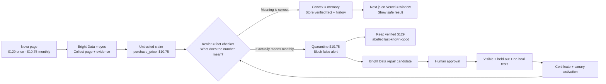

# Kevlar — understand-first live demo guide

This guide is designed to help you **understand the project once and then explain it in your own language**. Do not memorize every sentence. Remember the story, the role of each system, and the one key message on each page.

The live demo is **2 minutes 25 seconds**, leaving five seconds below your 2:30 target.

It covers the submission requirements naturally:

- **0:00–0:27:** what the project does, the practical problem, the stack, and the architecture;
- **0:27–2:11:** the working Bright Data and Kevlar demo;
- **2:11–2:25:** the measured result and what you learned.

## First understand the project in one sentence

> **Kevlar is a fact-checker and safety gate between a web scraper and the application that uses its data.**

Bright Data collects information from the web. Kevlar checks whether that information has the **correct meaning** before allowing an application or AI agent to use it.

## Understand the Nova example in simple language

The Nova headphones page contains two correct numbers:

- **$129** is the complete price of the headphones.
- **$10.75** is only the amount someone can pay each month.

These numbers are both valid, but they do not mean the same thing.

The relationship is easy to see: `$10.75 × 12 months = $129`. The monthly payment is the same total price divided into twelve smaller payments.

Now imagine the website changes its layout. The scraper continues working and returns valid JSON, but it accidentally puts `$10.75` inside the `purchase_price` field.

The data looks technically correct:

```json
{
  "purchase_price": 10.75
}
```

But the meaning is wrong. The headphones did not become $10.75. That number is only the monthly installment.

Without Kevlar, a shopping agent could believe the price fell from $129 to $10.75 and send users a fake, nearly **92% price-drop alert**.

In reality, nothing became cheaper. The scraper only confused **how much to pay each month** with **how much the product costs in total**.

That quiet mistake is the entire problem Kevlar solves.

## Why Bright Data does not make the final decision

Bright Data is not broken or generally incapable. It is doing the job we gave it:

- open and interact with the website;
- read the page;
- extract structured fields;
- capture visible text, JSON-LD, API data, and a screenshot;
- propose a repair when page structure changes.

Bright Data can successfully collect `$10.75`. However, collection alone does not answer the business question:

> “Does this number mean the full purchase price or a monthly payment?”

Bright Data can be given extraction rules and validation, but in this architecture we intentionally do not allow the collector to declare its own output as truth. The application needs a separate release gate that understands its business meaning and remembers previously verified facts.

That separate layer is Kevlar.

| Responsibility                                | Bright Data's role                 | Kevlar's role                             |
| --------------------------------------------- | ---------------------------------- | ----------------------------------------- |
| Open and interact with the page               | Does this                          | Uses the result                           |
| Extract `$129` and `$10.75`                   | Does this                          | Receives both as claims                   |
| Capture context, JSON-LD, API, and screenshot | Does this                          | Compares the evidence                     |
| Decide whether `$10.75` means purchase price  | Provides the clues                 | Enforces the meaning rule                 |
| Prevent an unsafe value from reaching users   | Not the collector's responsibility | Quarantines and blocks it                 |
| Keep the last verified `$129` available       | Not the collector's responsibility | Releases it as labelled last-known-good   |
| Repair a changed extractor                    | Proposes a candidate               | Requires review, tests, and certification |

The simplest analogy is:

- **Bright Data is the eyes:** it sees and collects what is on the page.
- **Kevlar is the fact-checker:** it checks what the number means and decides whether it is safe to release.
- **Convex is the memory:** it stores observations, decisions, and the last verified fact.
- **Next.js on Vercel is the window:** it shows the decision to people and applications.

## How Kevlar solves the mistake

When Kevlar receives `purchase_price: 10.75`, it does not immediately release it.

1. It sees nearby language such as **per month** or **financing**.
2. It notices that the field says `purchase_price`, but the surrounding words describe a monthly payment.
3. It compares the value with the page's JSON-LD and public API, which still report `129`.
4. It marks `$10.75` as suspicious and quarantines that observation.
5. It blocks the false price-drop alert.
6. It continues serving the previously verified `$129`, clearly marked **last-known-good** and **stale**.
7. Bright Data may propose a repaired collector, but Kevlar treats it only as a candidate.
8. A human reviews it, held-out and no-heal cases test it, and a certificate records the result before canary activation.

The visible text, JSON-LD, and API are different evidence channels from the same controlled source. They help expose disagreement; they are not three independent shops or market authorities.

## Remember this seven-step story

If you remember only these seven lines, you can explain the project without a script:

1. **The page contains two prices with different meanings.**
2. **A redesign makes the scraper confuse monthly payment with full price.**
3. **Bright Data collects the value and the evidence around it.**
4. **Kevlar checks meaning instead of trusting valid JSON.**
5. **Kevlar blocks `$10.75` and keeps verified `$129` available.**
6. **The repair must pass human review, unseen cases, and negative controls.**
7. **The final release remains measurable and explainable.**

## The architecture using the same example



The rule behind the diagram is:

```text
a successful scrape is a claim, not automatically a fact
```

## Prepare the live demo

### Recording setup

1. Record at 1920×1080 or 1440×900.
2. Record your screen and microphone together in one continuous take.
3. Turn on Do Not Disturb.
4. Open only the seven tabs below, in the exact order shown.
5. Load every page at least 30 seconds before recording. Do not refresh during the take.
6. Enter browser full screen with `F11`.
7. Use `Ctrl+Tab` for every page transition.
8. Complete one silent navigation rehearsal before recording with your voice.
9. Never show API keys, `.env` files, Convex deploy keys, Bright Data credentials, personal email, or the browser profile menu.

### Open these tabs from left to right

| Tab | Page                                                                                           | Starting position                                                              |
| --: | ---------------------------------------------------------------------------------------------- | ------------------------------------------------------------------------------ |
|   1 | [Kevlar home](https://kevlar-web.vercel.app)                                                   | Top with **Trust the fact. Question the repair.** visible.                     |
|   2 | Bright Data Output                                                                             | Successful preview for `kevlar-nova-product-pricing`, positioned at `product`. |
|   3 | [Trust Feed](https://kevlar-web.vercel.app/feed)                                               | Observed $10.75 and released $129 visible.                                     |
|   4 | [Held-Out Gauntlet](https://kevlar-web.vercel.app/gauntlet)                                    | Top with 8/8, 100%, 0, and 0 visible.                                          |
|   5 | [Nova Repair Certificate](https://kevlar-web.vercel.app/certificates/nova-core-20260822075230) | Collector identity and case totals visible.                                    |
|   6 | [Evidence Graph](https://kevlar-web.vercel.app/evidence)                                       | Graph summary metrics visible.                                                 |
|   7 | [Release Evidence](https://kevlar-web.vercel.app/release)                                      | `LABELED CHECKS 24/24` and `FALSE RELEASES 0` visible.                         |

### Prepare Bright Data before recording

1. In Bright Data, click **Scrapers**.
2. Open **kevlar-nova-product-pricing**.
3. Click **Code → Interaction code**.
4. In the lower panel, click **Input**.
5. Enter this required URL:

   ```text
   https://kevlar-fixture-lab.vercel.app/product-pricing/nova
   ```

6. Click the triangular Play button beside **Click play to test your code**.
7. Wait for a successful preview.
8. Click **Output**. If the large Output window does not open automatically, click the single collected result once.
9. Confirm it contains:
   - purchase price `129`;
   - monthly payment `10.75`;
   - JSON-LD price `129`;
   - public API price `129`;
   - screenshot evidence.
10. Leave the Output window open at `product` and return to Tab 1.

If the preview says `navigate(undefined)` or `url is required`, return to **Input**, enter the URL again, and rerun it.

Configure the safe Bright Data crop or privacy mask **before recording**, or apply it later during editing. Do not resize or crop the capture during the live walkthrough. The final video must not show the credit balance, profile initial, Billing section, address-bar draft ID, Run log, peer IP, or account email. Never click **Active scraper**, **Finish editing**, **Start**, or a download button during the presentation.

## Live walkthrough in your own words

The sections below tell you the **idea to communicate**, not sentences you must memorize.

### 0:00–0:27 — Explain the problem and architecture

**Page:** Kevlar home.

**What the audience is seeing:** the product headline and the **Acquire → Persist → Verify → Release** pipeline.

**What you need to understand:**

- The headphones have a full price and a monthly payment.
- The page redesign does not break the JSON; it changes which number the scraper selects.
- Bright Data performs **Acquire**.
- Convex provides memory and persistence.
- Kevlar performs semantic verification before release.
- Next.js on Vercel shows the result.

**What to do:**

1. Hold the hero section for about 12 seconds while introducing the Nova example.
2. Slowly scroll to **Acquire → Persist → Verify → Release**.
3. Point across the pipeline while explaining the roles above.
4. At 0:27, press `Ctrl+Tab`.

**Explain it naturally:**

> Nova costs 129 dollars, or 10.75 each month. A redesign makes the scraper put the monthly amount where the full price should be. The JSON still looks valid, but the meaning is wrong. Bright Data collects the page, Convex remembers the history, Kevlar checks the meaning, and the Next.js application shows the safe decision.

**Memory sentence:** valid format does not guarantee correct meaning.

**Natural transition:** “First, let me show what Bright Data actually collected.”

### 0:27–0:45 — Show Bright Data doing its job

**Page:** Bright Data Output.

**What the audience is seeing:** the healthy structured preview with `129`, `10.75`, JSON-LD, API data, and screenshot evidence.

**What you need to understand:** Bright Data is working correctly here. It is the acquisition and evidence layer, not the final truth authority.

**What to do:**

1. Point to purchase price `129`.
2. Point to monthly payment `10.75`.
3. Scroll inside the Output window to JSON-LD `129`, API `129`, and the screenshot reference.
4. At 0:45, press `Ctrl+Tab`.

**Explain it naturally:**

> Bright Data's custom Browser collector opens the controlled Nova page and keeps both values separate. It captures their context, JSON-LD, the API response, and a screenshot. Kevlar uses that evidence to check the meaning.

**Memory sentence:** Bright Data gathers the claim and the evidence.

**Natural transition:** “Now let us see what happens after the redesigned page confuses the collector.”

### 0:45–1:12 — Show Kevlar blocking the wrong meaning

**Page:** Trust Feed.

**What the audience is seeing:** observed `$10.75`, released `$129`, three violations, and a blocked alert.

**What you need to understand:**

- `$10.75` is not rejected because it is an invalid number.
- It is rejected because nearby words show that it means monthly financing.
- JSON-LD and the API still say `$129`.
- Kevlar does not delete history or pretend nothing happened.
- It quarantines the new observation and continues serving `$129` as labelled last-known-good and stale.

**What to do:**

1. Point to **Observed by collector — $10.75**.
2. Point to JSON-LD and public API `129`.
3. Point to **3 violations** and **Alert consumer — blocked**.
4. Finish on **Released fact — $129.00** and **Last-known-good · stale**.
5. At 1:12, press `Ctrl+Tab`.

**Explain it naturally:**

> The redesigned page fools the collector into reporting 10.75 as the full price. Kevlar notices the financing language and the disagreement with the other evidence. It blocks the false alert, quarantines 10.75, and keeps the verified 129-dollar price available without pretending it is fresh.

**Memory sentence:** Kevlar blocks the bad claim without taking the product offline.

**Natural transition:** “Blocking one bad value is useful, but how do we know a repair will work on other pages?”

### 1:12–1:34 — Show that the repair generalized

**Page:** Held-Out Gauntlet.

**What the audience is seeing:** 8/8 cases passed, 100% held-out pass, zero false heals, and zero false releases.

**What you need to understand:**

- Bright Data may propose a repair candidate.
- Kevlar does not accept it only because it works on Nova.
- Four visible cases test known changes.
- Two held-out layouts test DOM relationships the repair did not see while being developed.
- Two no-heal controls make sure the repair refuses to invent data when it should not heal.

**What to do:**

1. Point across the four headline metrics.
2. At about 1:22, scroll through H1/H2 and N1/N2.
3. At 1:34, press `Ctrl+Tab`.

**Explain it naturally:**

> Bright Data can propose a repair, but Kevlar asks whether it really learned the meaning or only memorized this one layout. The repair must pass known cases, unseen layouts, and cases where doing nothing is the correct choice. All eight pass without a false heal or release.

**Memory sentence:** a repair is a candidate until it proves it can generalize.

**Natural transition:** “Even passing tests does not give the repair permission to enter production.”

### 1:34–1:55 — Show approval and certification

**Page:** Nova Repair Certificate.

**What the audience is seeing:** the same collector identity, 4/4 visible, 2/2 held-out, 2/2 negative controls, human approval, and an integrity digest.

**What you need to understand:**

- A human reviewed the repair before certification.
- The certificate records which collector was tested and the measured results.
- The integrity digest helps detect whether the certificate's measured payload has changed. It is not a digital signature.
- Only the certified repair may enter limited canary activation.

**What to do:**

1. Point to the collector identity and case totals.
2. At about 1:45, scroll once to human approval and the integrity digest.
3. At 1:55, press `Ctrl+Tab`.

**Explain it naturally:**

> Passing tests alone does not release the repair. This certificate connects the same collector, the earlier human approval, the visible and held-out layout results, and an integrity digest. Only that certified repair can move into a limited canary.

**Memory sentence:** the certificate is the repair's permission slip, not just a green test result.

**Natural transition:** “Now I can also prove why a released result was trusted.”

### 1:55–2:11 — Show the evidence trail

**Page:** Evidence Graph.

**What the audience is seeing:** 14 nodes, 13 edges, 10 artifacts, four archived evidence items, and a downloadable bundle.

**What you need to understand:** this graph describes a verified release chain. It connects a released event to its fact, verified observation, collector, evidence, and repair certificate.

**What to do:**

1. Point across the four summary metrics.
2. Point at **Open downloadable evidence bundle**, but do not click it.
3. Slowly scroll through `change_event`, `fact_version`, `repair_certificate`, `observation`, `collector`, and `evidence`.
4. At 2:11, press `Ctrl+Tab`.

**Explain it naturally:**

> A green badge is not enough. This graph lets a reviewer follow a released event back through the fact, verified observation, collector, evidence, and certificate. The same proof can be downloaded as a bundle.

**Memory sentence:** every released fact keeps its receipt.

**Natural transition:** “Finally, here is the measured result of the complete controlled flow.”

### 2:11–2:25 — Finish with the result and lesson

**Page:** Release Evidence.

**What the audience is seeing:** `LABELED CHECKS 24/24` and `FALSE RELEASES 0`.

**What you need to understand:** this is a controlled, fixture-backed benchmark. It proves this rehearsed workflow; it is not a claim of perfect accuracy across the entire web.

**What to do:**

1. Point to **LABELED CHECKS — 24/24**.
2. Point to **FALSE RELEASES — 0**.
3. Stop moving and deliver the final lesson.

**Explain it naturally:**

> All 24 controlled checks pass with zero false releases. The lesson is simple: valid JSON is not always true data. Bright Data keeps collection running; Kevlar keeps released facts honest.

**Memory sentence:** scraper uptime is not the same as data truth.

## Questions a judge may ask

### “Is Bright Data failing here?”

The Bright Data platform is still running successfully, but the collector's old extraction logic is fooled by the redesigned layout. Bright Data captures the evidence and can propose a repair; Kevlar independently decides whether that output is safe to release.

### “Why not use normal schema validation?”

Because both `$129` and `$10.75` are valid numbers. The problem is not the data type; it is the meaning of the number.

### “Why keep $129 instead of showing nothing?”

The last verified value is still useful if it is clearly labelled stale. Kevlar preserves availability without pretending the old value is fresh.

### “Why use held-out and no-heal cases?”

Held-out layouts check that the repair works beyond the DOM pattern it learned from. No-heal controls check that it does not invent data when the safest action is to refuse.

### “What is the technology stack?”

Bright Data handles browser collection and evidence. TypeScript implements the contracts and release rules. Convex stores reactive state and history. Next.js provides the product interface, deployed on Vercel.

### “What is the main innovation?”

Kevlar separates a successfully scraped row from a verified fact. It also treats an automatic repair as untrusted until review, testing, and certification prove it is safe.

## Final rehearsal checklist

Before recording, confirm:

- you can explain the two-price problem without looking at this file;
- you remember **eyes → fact-checker → memory → window**;
- Bright Data Output shows 129, 10.75, JSON-LD 129, API 129, and screenshot evidence;
- Trust Feed shows observed $10.75, released $129, three violations, and a blocked alert;
- Gauntlet shows 8/8, 100%, zero false heals, and zero false releases;
- the certificate shows the same collector, 4/4, 2/2, 2/2, human approval, and integrity digest;
- Evidence Graph shows 14 nodes, 13 edges, 10 artifacts, and four archived evidence items;
- Release Evidence shows 24/24 and zero false releases;
- no spinner, notification, email, credential, or unrelated tab is visible.

If a live value differs, stop and fix the page instead of explaining around contradictory evidence.

Always say **controlled benchmark** or **fixture-backed benchmark**. Never describe 24/24 as general web accuracy.
