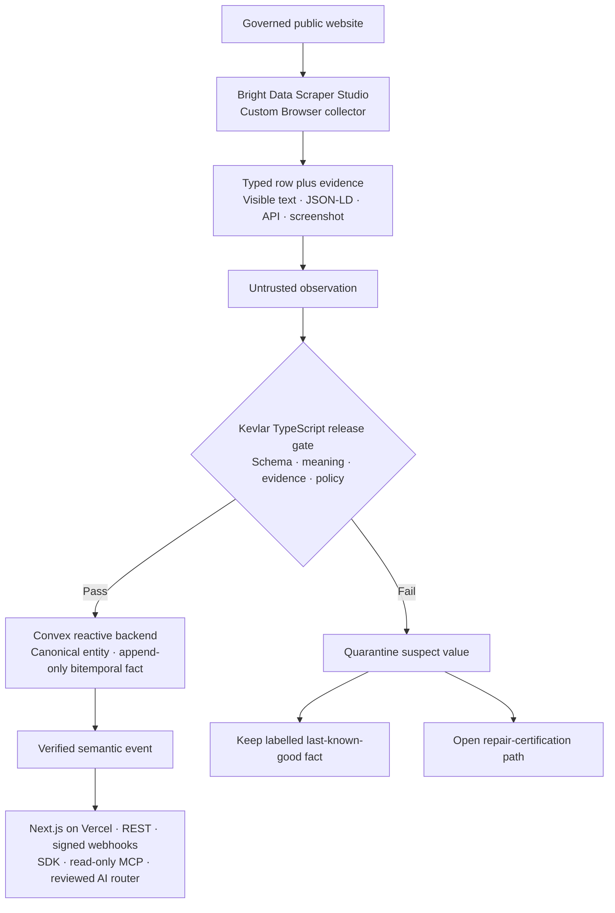
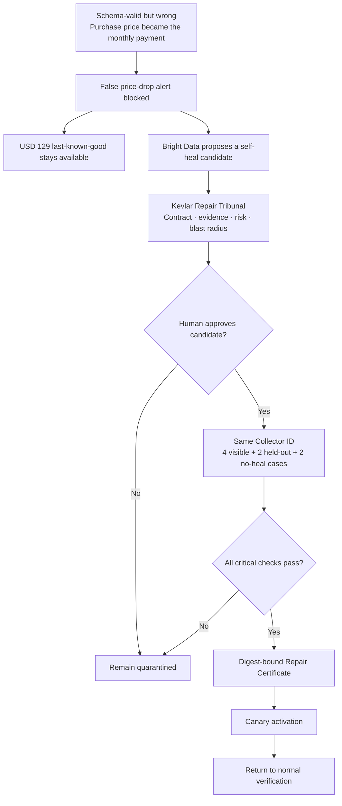

# Kevlar — 2:25 hackathon voiceover demo

Record the visuals first without speaking. Assemble the eight silent clips into a 2:25 timeline, then record the voiceover while watching the finished sequence.

The final structure follows the submission form exactly:

- **0:00–0:40 — About the project:** explain the problem and the Nova example;
- **0:40–1:10 — Tech stack and architecture:** show how Bright Data, TypeScript, Next.js, Convex, Vercel, and Kevlar's release gate work together;
- **1:10–2:12 — Demo:** show the real collector, structured evidence, blocked false value, and repair proof;
- **2:12–2:25 — Learning and growth:** close with what the project taught us and the measured result;
- **final duration:** exactly **2:25**, leaving a five-second buffer below 2:30 and remaining well under the form's three-minute maximum.

## Project flowcharts

> **Kevlar is a verification firewall for live-web intelligence: Bright Data collects and self-heals, while Kevlar decides what is safe to release.**

These are the visuals for Clips 2 and 3. Render this Markdown in GitHub or another Mermaid-compatible preview before recording.

### Core system flow



The invariant behind the diagram is:

```text
collector row != verified observation != released fact
```

### Repair-certification flow



### Three ideas the judge should remember

1. **A successful scrape is not automatically true.** Kevlar verifies semantic meaning before release.
2. **Bright Data is central.** Its custom Scraper Studio collector performs acquisition, structured extraction, evidence capture, and the repair workflow.
3. **A self-heal is still untrusted.** It must pass human review, held-out tests, negative controls, and certification before canary activation.

## Part 1 — Record these clips first

### The rule for every clip

Navigation and loading happen **before** recording. For every take:

1. Navigate to the required page while the recorder is stopped.
2. Put the page at the exact starting position described below.
3. Check that the page has finished loading and no tooltip covers the evidence.
4. Start recording and do not touch anything for two seconds. This is the opening edit handle.
5. Perform only the actions in that clip's timeline.
6. Hold the final screen for two seconds, then stop recording. This is the closing edit handle.
7. Remove the two handles when editing and keep the stated final duration.

Do not record one continuous browser session. Record eight separate files so navigation mistakes can never enter the final video.

Every timing table below describes the **kept final clip**. Each raw file is exactly `two-second opening handle + complete timing table + two-second closing handle`. Start the table's `0:00` row only after the opening handle.

### One-time recording setup

1. Set the display to 1920×1080 if available; 1440×900 is also acceptable.
2. Set browser zoom to 100%. For a Mermaid diagram only, reduce it to 80% or 90% if the complete diagram does not fit.
3. Record the browser content area, not the whole desktop. Keep the microphone muted because narration is added later.
4. Turn on Do Not Disturb. If the bookmarks bar is visible, hide it with `Ctrl+Shift+B`; if it is already hidden, leave it alone.
5. Close unrelated tabs. Hide any personal email, browser profile menu, extensions, notifications, and download history.
6. Never display an API token, Convex deploy key, `.env` file, authorization header, webhook secret, or Bright Data credential.
7. Use a slow cursor. Move it beside a value rather than directly over text, so the text remains readable.
8. Do not click the Bright Data **Active scraper** switch, **Finish editing**, or any delete/menu control.
9. On Bright Data, crop out the credit balance, profile initial/menu, **Billing**, browser address bar and draft ID, Run log, peer IP, and any Runs-table trigger email.

### Prepare the browser tabs in this exact order

Open these tabs before recording anything. Copy each address directly into a new tab, wait for it to load, and then leave it open.

| Tab | Page to prepare       | Address or navigation                                                                                                          |
| --: | --------------------- | ------------------------------------------------------------------------------------------------------------------------------ |
|   1 | Kevlar home           | [https://kevlar-web.vercel.app](https://kevlar-web.vercel.app)                                                                 |
|   2 | Core flowchart        | [GitHub-rendered Core system flow](https://github.com/Avinash1286/kevlar/blob/main/demo.md#core-system-flow)                   |
|   3 | Repair flowchart      | [GitHub-rendered Repair-certification flow](https://github.com/Avinash1286/kevlar/blob/main/demo.md#repair-certification-flow) |
|   4 | Bright Data collector | Bright Data control panel → **Scrapers** → **kevlar-nova-product-pricing**                                                     |
|   5 | Trust Feed            | [https://kevlar-web.vercel.app/feed](https://kevlar-web.vercel.app/feed)                                                       |
|   6 | Held-Out Gauntlet     | [https://kevlar-web.vercel.app/gauntlet](https://kevlar-web.vercel.app/gauntlet)                                               |
|   7 | Release Evidence      | [https://kevlar-web.vercel.app/release](https://kevlar-web.vercel.app/release)                                                 |

Tabs 2 and 3 are the same GitHub file at different anchors. Keep both open so you never scroll between the two diagrams while recording. Tab 4 is used for both Bright Data clips; the exact off-camera transition between those clips is below.

Prepare the GitHub diagrams in a signed-out Incognito window, or crop away the GitHub header so no avatar or username appears. In either diagram tab, press `Ctrl+0` and then `Ctrl+-` twice to set GitHub to 80%; Chrome applies that zoom to both GitHub tabs.

After the tabs are ready, use `Ctrl+Tab` only while the recorder is stopped. If the GitHub diagrams are in a separate Incognito window, use `Alt+Tab` to enter or leave that window, again only while stopped. If the browser chrome would expose personal information, enter full screen with `F11` immediately before each take and leave it with `F11` immediately afterward.

### Final shot list

| Clip | Rubric section    | Final length | Raw recording target | Suggested filename         | Screen                              |
| ---- | ----------------- | -----------: | -------------------: | -------------------------- | ----------------------------------- |
| 1    | About the project |       12 sec |               16 sec | `01-home.mp4`              | Kevlar home                         |
| 2    | About the project |       28 sec |               32 sec | `02-core-flow.mp4`         | Core system flowchart               |
| 3    | Tech/architecture |       30 sec |               34 sec | `03-repair-flow.mp4`       | Repair-certification flowchart      |
| 4    | Demo              |       14 sec |               18 sec | `04-brightdata-code.mp4`   | Bright Data interaction/parser code |
| 5    | Demo              |       15 sec |               19 sec | `05-brightdata-output.mp4` | Bright Data structured Output       |
| 6    | Demo              |       17 sec |               21 sec | `06-trust-feed.mp4`        | Kevlar Trust Feed                   |
| 7    | Demo              |       16 sec |               20 sec | `07-gauntlet.mp4`          | Held-Out Gauntlet                   |
| 8    | Learning/close    |       13 sec |               17 sec | `08-release.mp4`           | Release evidence                    |

The edited clips total exactly **145 seconds (2:25)**.

### Clip 1 — Kevlar home

**Open:** [https://kevlar-web.vercel.app](https://kevlar-web.vercel.app)

**Navigate before recording:**

1. Select Tab 1.
2. If you are not at the top, press `Home` once.
3. Wait until **Trust the fact. Question the repair.** is visible and the page has stopped moving.
4. Place the cursor in an empty margin. Do not hover over a link or button.

**Record `01-home.mp4`:**

| Final clip time | Exact screen action                                                                                                      |
| --------------- | ------------------------------------------------------------------------------------------------------------------------ |
| 0:00–0:03       | Hold the hero headline without moving the cursor.                                                                        |
| 0:03–0:09       | Scroll down slowly with the mouse wheel until **Acquire → Persist → Verify → Release** is centered. Do not flick-scroll. |
| 0:09–0:12       | Stop scrolling and hold on the complete pipeline.                                                                        |

Stop after the closing two-second handle. Keep **12 seconds** in the edit. Do not click **Open the Trust Feed**; the feed gets its own clip later.

### Clip 2 — Core system flow

**Open:** [GitHub-rendered Core system flow](https://github.com/Avinash1286/kevlar/blob/main/demo.md#core-system-flow)

**Navigate before recording:**

1. Select Tab 2. The address must end in `demo.md#core-system-flow`.
2. Wait for GitHub to render the diagram; do not record a Mermaid code block or loading placeholder.
3. Scroll until the title **Core system flow** and the complete diagram are visible.
4. Confirm the GitHub zoom prepared above is 80% and the complete diagram fits. Do not change zoom while recording.
5. Put the cursor in the blank area to the left of **Governed public website**.

**Record `02-core-flow.mp4`:**

| Final clip time | Exact screen action                                                                                      |
| --------------- | -------------------------------------------------------------------------------------------------------- |
| 0:00–0:03       | Hold the complete diagram.                                                                               |
| 0:03–0:08       | Move left-to-right beside **Governed public website**, **Bright Data**, and **Typed row plus evidence**. |
| 0:08–0:13       | Continue to **Untrusted observation**, then stop beside **Kevlar release gate**.                         |
| 0:13–0:21       | Trace the **Fail** branch to quarantine and the labelled last-known-good fact.                           |
| 0:21–0:26       | Return through the typed evidence to the release gate, matching the spoken architecture line.            |
| 0:26–0:28       | Hold with the TypeScript, Convex, Next.js/Vercel, and Bright Data labels visible.                        |

Keep **28 seconds**. Do not scroll during the take and do not open GitHub links or repository navigation.

### Clip 3 — Repair-certification flow

**Open:** [GitHub-rendered Repair-certification flow](https://github.com/Avinash1286/kevlar/blob/main/demo.md#repair-certification-flow)

**Navigate before recording:**

1. Select Tab 3. The address must end in `demo.md#repair-certification-flow`.
2. Wait for the diagram to render.
3. Scroll until **Repair-certification flow** and the whole diagram are visible.
4. Confirm the GitHub zoom is already 80% and the lowest **Return to normal verification** box fits on screen.
5. Place the cursor beside the first **Schema-valid but wrong** box.

**Record `03-repair-flow.mp4`:**

| Final clip time | Exact screen action                                                                                       |
| --------------- | --------------------------------------------------------------------------------------------------------- |
| 0:00–0:13       | Hold the complete diagram still while the stack caption is displayed; keep the cursor in an empty corner. |
| 0:13–0:17       | Trace **Schema-valid but wrong → False price-drop alert blocked**.                                        |
| 0:17–0:22       | Move to **USD 129 last-known-good stays available** and hold briefly.                                     |
| 0:22–0:27       | Follow **Bright Data proposes a self-heal → Repair Tribunal → Human approves → Gauntlet**.                |
| 0:27–0:30       | Finish on **Pass → Digest-bound Repair Certificate → Canary activation**.                                 |

Keep **30 seconds**. Do not scroll or change zoom during the take.

During editing, place this small caption in an empty corner from Clip 3 `0:00` to `0:13`, then fade it out:

```text
STACK  TypeScript · Next.js on Vercel · Convex · Bright Data
```

### Clip 4 — Bright Data custom collector code

**Navigate before recording:**

1. Select Tab 4 and sign in to Bright Data if needed. Stop here if a login screen is visible; never record the login.
2. In the dark left sidebar, click **Scrapers**.
3. Under **My scrapers**, click **kevlar-nova-product-pricing**.
4. In the collector's top navigation, click **Code**.
5. In the code panel's left column, click **Interaction code**.
6. Scroll the code editor—not the whole page—until `tag_script` and `tag_response` are visible. `navigate` and `tag_screenshot` are farther down and will appear during one slow editor-only scroll in the take.
7. Check that the collector name is visible near the upper left. The **Active scraper** switch may be visible, but do not touch it.
8. Crop or position the capture so no account email or profile menu is shown.

**Record `04-brightdata-code.mp4`:**

| Final clip time | Exact screen action                                                                                      |
| --------------- | -------------------------------------------------------------------------------------------------------- |
| 0:00–0:02       | Hold with **kevlar-nova-product-pricing**, **Code**, and **Interaction code** visible.                   |
| 0:02–0:05       | Move beside `tag_script` and `tag_response`. Do not select the text.                                     |
| 0:05–0:08       | Scroll only inside the editor until `navigate` and `tag_screenshot` appear; pause beside them.           |
| 0:08–0:09       | Move to the left code menu and click **Parser code** exactly once.                                       |
| 0:09–0:14       | Hold on the parser code. If needed, make one very small editor scroll to show the returned typed fields. |

Keep **14 seconds**. Do not click Play, **Finish editing**, **Active scraper**, the three-dot menu, or any account control.

During editing, add this small caption in a safe empty corner for the full clip; the collector ID is not a secret:

```text
Bright Data collector ID: c_mt3utzwt29hbznvax9
```

### Clip 5 — Bright Data structured output

This clip begins only after a successful preview is ready. The following preparation happens with the recorder **stopped**.

**Prepare the Output panel off-camera:**

1. Stay on the same collector and click **Code** in the top navigation.
2. Click **Interaction code** in the left code menu.
3. In the panel below the editor, click the **Input** tab.
4. Find the required field named `url` and enter exactly:

```text
https://kevlar-fixture-lab.vercel.app/product-pricing/nova
```

5. Click the triangular **Play** button beside **Click play to test your code**.
6. Wait until the run finishes. Do not continue if the log says `navigate(undefined)` or `url is required`; return to **Input**, re-enter the URL, and run again.
7. Click **Output** in the lower panel. If the large **Output** modal opens immediately, stop clicking. Otherwise, click the single collected output row once to open it.
8. Confirm all of these are present before recording:
   - `page_state: ok`;
   - `product.purchase_price.amount: 129`;
   - `product.monthly_payment.amount: 10.75`;
   - `independent_sources.jsonld_price: 129`;
   - `independent_sources.public_api_price: 129`;
   - `evidence.screenshot_ref`.
9. Confirm the expanded or wrapped `product` JSON visibly contains both `129` and `10.75`. If either value is truncated, lower the Bright Data browser zoom to 80% or 90% while the recorder is stopped until both values wrap into view.
10. Scroll the modal back so the `product` row is the first proof visible. Keep the **Output** heading visible. Restore normal browser zoom after this take.

**Record `05-brightdata-output.mp4`:**

| Final clip time | Exact screen action                                                                                     |
| --------------- | ------------------------------------------------------------------------------------------------------- |
| 0:00–0:05       | Hold on `product`; move beside purchase price `129` and monthly payment `10.75`.                        |
| 0:05–0:10       | Scroll the modal—not the page—to `independent_sources`; stop beside JSON-LD `129` and public API `129`. |
| 0:10–0:15       | Scroll to `evidence`; point to the purchase context and `screenshot_ref`, then hold.                    |

Keep **15 seconds**. Do not close the modal during the take.

**Diagnostic fallback only—this consumes a provider run and the recorder must remain stopped:** click **Initiate manually** in the collector's top navigation, enter the same URL in `url`, click **Start**, open **Runs**, wait for a completed row with **Records 1** and **Failed crawls 0**, and use **Download file options → JSON** to confirm the values. Never capture the Runs screen because its Trigger column can show your email. Then return to **Code → Interaction code → Input**, enter the URL again, click Play, and reopen the successful Output modal before filming.

### Clip 6 — Kevlar blocks the wrong value

**Open:** [https://kevlar-web.vercel.app/feed](https://kevlar-web.vercel.app/feed)

**Navigate before recording:**

1. Select Tab 5.
2. Press `Home` and wait for the Trust Feed data to appear.
3. Make one small scroll only if necessary to fit **Observed by collector**, **Released fact**, the violations count, and the alert card in the captured area.
4. Confirm the screen says observed `$10.75`, released `$129.00`, **3 violations**, and **Alert consumer — blocked**. If any value differs, stop and do not record stale or loading content.
5. Place the cursor beside the observed value.

**Record `06-trust-feed.mp4`:**

| Final clip time | Exact screen action                                                                              |
| --------------- | ------------------------------------------------------------------------------------------------ |
| 0:00–0:04       | Point beside **Observed by collector — $10.75**.                                                 |
| 0:04–0:09       | Move to **Released fact — $129.00**, then underline **Last-known-good · stale** with the cursor. |
| 0:09–0:13       | Move to **3 violations** and pause.                                                              |
| 0:13–0:17       | Finish beside **Alert consumer — blocked** and hold.                                             |

Keep **17 seconds**. Do not click a card or navigate away.

### Clip 7 — Kevlar proves the repair

**Open:** [https://kevlar-web.vercel.app/gauntlet](https://kevlar-web.vercel.app/gauntlet)

**Navigate before recording:**

1. Select Tab 6 and press `Home`.
2. Wait until the status is **completed**.
3. Confirm the four headline cards say **8/8**, **100%**, **0**, and **0**.
4. Before recording, practice one smooth scroll from the metric cards to held-out cases H1/H2 and then to negative controls N1/N2. Return to the top with `Home`.
5. Start with the cursor beside **8/8**.

**Record `07-gauntlet.mp4`:**

| Final clip time | Exact screen action                                                                                                  |
| --------------- | -------------------------------------------------------------------------------------------------------------------- |
| 0:00–0:06       | Move left-to-right across **8/8 cases passed**, **100% held-out pass**, **0 false heals**, and **0 false releases**. |
| 0:06–0:10       | Scroll down smoothly until held-out cases H1 and H2 are visible. Pause briefly beside their passing outcomes.        |
| 0:10–0:13       | Continue scrolling until negative controls N1 and N2 are visible.                                                    |
| 0:13–0:16       | Hold on the negative-control pass outcomes without moving.                                                           |

Keep **16 seconds**. If you overshoot a case, stop and restart the take instead of scrolling back upward.

### Clip 8 — End on measured proof

**Open:** [https://kevlar-web.vercel.app/release](https://kevlar-web.vercel.app/release)

**Navigate before recording:**

1. Select Tab 7 and press `Home`.
2. Wait for the release metrics to load.
3. Confirm the **LABELED CHECKS** card shows `24/24` and the **FALSE RELEASES** card shows `0`. Keep the release heading in frame.
4. Place the cursor in an empty area beside the first metric.

**Record `08-release.mp4`:**

| Final clip time | Exact screen action                                                      |
| --------------- | ------------------------------------------------------------------------ |
| 0:00–0:06       | Hold the release heading and both metric cards while stating the lesson. |
| 0:06–0:09       | Move beside the **LABELED CHECKS** card and its `24/24` value.           |
| 0:09–0:11       | Move once to the **FALSE RELEASES** card and its `0` value.              |
| 0:11–0:13       | Hold the release proof completely still through the closing words.       |

Keep **13 seconds**. Do not scroll or click anything.

### Exact navigation between takes

Use this order. Every arrow means: stop the recorder, save the current file, navigate, prepare the next starting frame, and only then start a new recording.

```text
Tab 1 Home
  → Tab 2 Core flowchart
  → Tab 3 Repair flowchart
  → Tab 4 Bright Data Interaction code
  → stop and prepare Bright Data Output on the same tab
  → Tab 5 Trust Feed
  → Tab 6 Gauntlet
  → Tab 7 Release Evidence
```

At the end, verify that the recording folder contains exactly these eight raw files:

```text
01-home.mp4
02-core-flow.mp4
03-repair-flow.mp4
04-brightdata-code.mp4
05-brightdata-output.mp4
06-trust-feed.mp4
07-gauntlet.mp4
08-release.mp4
```

## Part 2 — Add this continuous voiceover

Assemble and trim all eight clips before recording the voiceover. Record one continuous take while watching the 2:25 timeline. The clip divisions below only show where each passage belongs; do not announce clip numbers, pause between sections, or reset your tone. It should sound like one story.

The script is about **312 words**, or **129 words per minute** across 2:25. Read it calmly; do not speed up to fill a clip. If a sentence crosses a visual cut by a fraction of a second, keep speaking naturally.

Read prices conversationally: say **“one twenty-nine”** for $129 and **“ten seventy-five a month”** for $10.75/month.

### Voiceover for Clip 1 — 0:00–0:12 — About the project

> “Most web-data failures announce themselves. The dangerous ones do not: a scraper can return perfect-looking JSON with the wrong meaning. Kevlar is the verification firewall for that moment.”

### Voiceover for Clip 2 — 0:12–0:40 — Example and architecture

> “Picture Nova headphones: the one-time price is 129 dollars, with a 10.75 monthly plan. After a redesign, the collector mistakes that monthly amount for the purchase price. The schema still passes, so an ordinary pipeline announces a false price drop. Our architecture instead sends Bright Data's typed observation and evidence into Kevlar before anything reaches an application.”

### Voiceover for Clip 3 — 0:40–1:10 — Tech stack and repair architecture

> “Kevlar is built in TypeScript: Next.js on Vercel for the product, Convex for the reactive backend and append-only facts, and Bright Data for browser acquisition and self-heal proposals. The release gate compares meaning with evidence. A disagreement is quarantined while the labelled last-known-good fact stays available. Any repair then needs Tribunal review, human approval, held-out and negative tests, and a digest-bound certificate before canary activation.”

### Voiceover for Clip 4 — 1:10–1:24 — Demo: collector code

> “Now the real path. This custom Bright Data Scraper Studio worker opens Nova, tags JSON-LD, the public API, visible context and screenshot evidence, then parses one typed record.”

### Voiceover for Clip 5 — 1:24–1:39 — Demo: healthy output

> “In a healthy output, the purchase price is 129 and the monthly payment is 10.75. JSON-LD and the API both confirm 129, and the evidence remains attached to the row.”

### Voiceover for Clip 6 — 1:39–1:56 — Demo: false value blocked

> “Then the redesign creates a corrupted observation. The Trust Feed receives 10.75 as the purchase price, recognizes the financing language, and keeps 129 available as clearly labelled last-known-good. It reports three violations and blocks the false alert.”

### Voiceover for Clip 7 — 1:56–2:12 — Demo: repair proof

> “Bright Data can propose a fix, but Kevlar asks whether it learned the meaning or memorized one page. The Gauntlet tests four visible, two held-out and two no-heal cases. All pass, with no false heals or releases.”

### Voiceover for Clip 8 — 2:12–2:25 — Learning, growth, and close

> “Biggest lesson: uptime is not truth. One broken selector became a release discipline. Twenty-four controlled checks pass, with zero false releases. Bright Data keeps collectors alive; Kevlar keeps facts honest.”

## Part 3 — Assemble the final video

1. Put Clips 1–8 on the timeline in numerical order.
2. Trim them to the exact final lengths in the shot-list table.
3. Use clean cuts. Avoid decorative transitions that hide evidence or consume time.
4. Record the voiceover while watching the assembled 2:25 timeline.
5. Start the first spoken word at 0:00 and finish the closing word by 2:25. The submitted video must never exceed 2:30.
6. If recording each voiceover clip separately, keep the same microphone distance and tone, and leave half a second of room tone at both ends.
7. Keep background music optional and very low; speech must remain dominant.
8. Generate captions from the final voice track and manually correct Kevlar, Bright Data, Scraper Studio, JSON-LD, Gauntlet, and last-known-good.
9. Check that no Bright Data email, profile name, token, or unrelated browser tab is visible.
10. Export as H.264 video with AAC audio.
11. Watch the export from beginning to end and confirm the duration is exactly 2:25 or a few frames shorter.

## Final proof checklist

Before exporting, confirm the recorded screens show:

- Bright Data custom collector `kevlar-nova-product-pricing`;
- custom Interaction and Parser code;
- purchase price $129 and monthly payment $10.75;
- JSON-LD and public API values of 129;
- Trust Feed observed $10.75 but released $129 last-known-good;
- blocked false alert;
- Gauntlet 8/8, 100% held-out, zero false heals, and zero false releases;
- Release Evidence 24/24 controlled checks and zero false releases.

Use the phrase **controlled checks** or **fixture-backed benchmark**. Do not present these measurements as general web accuracy.
